# Stellar Classification - Kaggle Playground Series S6E6

This repository contains the complete pipeline, models, and exploratory research for the **Stellar Classification** Kaggle Playground Series (Season 6, Episode 6).

## Competition Overview
- **Link:** [Kaggle Competition: Predicting Stellar Class](https://www.kaggle.com/competitions/playground-series-s6e6)
- **Objective:** Predict the stellar class of astronomical objects into three categories:
  - `GALAXY`
  - `STAR`
  - `QSO` (Quasar)
- **Evaluation Metric:** Balanced Accuracy

---

# Results & Leaderboard Progress

Feature engineering and validation scaling were the primary drivers of performance in this competition. The table below outlines our leaderboard progression across all experiment phases:

| Experiment | Validation (CV) Score | Public LB Score | Key Adjustments & Hyperparameters |
| :--- | :---: | :---: | :--- |
| **CatBoost GPU Baseline** | 0.952326 (5-Fold) | 0.95304 | Baseline features + standard color indices. |
| **XGBoost GPU + Advanced Features** | 0.957325 (5-Fold) | 0.95798 | Added sky coordinates, mag ratios, polynomial redshift. |
| **CatBoost/XGBoost Ensemble** | N/A | 0.95726 | Weighted blending of baseline probability models. |
| **Optuna XGBoost** | 0.953409 (5-Fold) | 0.95627 | Hyperparameter tuning on baseline features. |
| **XGBoost Feature Engineering V2** | 0.958038 (5-Fold) | 0.95904 | Trig sky coordinates, redshift-to-band interactions. |
| **XGBoost Feature Engineering V3** | 0.958092 (5-Fold) | 0.95875 | Higher-order redshift polynomials and interaction terms. |
| **XGBoost Model A** (08a) | 0.958038 (5-Fold) | 0.95904 | `max_depth=6`, `lr=0.05`, `n_est=2500` (V2 feature baseline) |
| **XGBoost Model B** (08b) | 0.958041 (5-Fold) | 0.95879 | Same as Model A (differs due to GPU non-determinism). |
| **XGBoost Model C** (08c) | 0.957964 (5-Fold) | **0.95913** | **`max_depth=10`, `lr=0.02`, `n_est=2500` (Best Public Score).** |
| **XGBoost Model D** (08d) | 0.957999 (5-Fold) | 0.95904 | `max_depth=8`, `lr=0.03`, `n_est=2500`, `seed=2025` |
| **XGBoost Model E** | 0.957890 (25-Fold) | 0.95862 | `max_depth=10`, `lr=0.02`, `n_est=3000` (25-Fold Stratified CV) |
| **XGBoost Model F** (08f) | 0.957887 (30-Fold) | 0.95864 | `max_depth=10`, `lr=0.015`, `n_est=4000` (30-Fold Stratified CV) |
| **XGBoost Pseudo-Labeling (Model 1)** | N/A | 0.95876 | Retrained model on high-confidence pseudo-labeled test rows. |
| **XGBoost Pseudo-Labeling (Model 2, v1)** | N/A | 0.95833 | Alternate pseudo-label iteration. |
| **XGBoost Pseudo-Labeling (Model 2, v2)** | N/A | 0.95889 | High-confidence augmented training with optimized threshold. |

---

# Repository Analysis & Directory Structure

Below is an exhaustive breakdown of all files and folders in this repository, mapping what each file does:

```text
stellar-classification-kaggle-s6e6/
├── .gitignore                          # Standard git ignore configurations (ignores raw datasets, credentials, and local outputs)
├── LICENSE                             # Project license details (Apache/MIT)
├── README.md                           # Comprehensive documentation and project analysis (this file)
├── requirements.txt                    # Project package dependencies (pandas, xgboost, catboost, optuna, etc.)
│
├── data/                               # Directory to host raw competition files (gitignored)
│   └── .gitkeep                        # Empty tracking file keeping the folder in Git
│
├── notebooks/                          # Jupyter Notebooks representing successive experiment phases
│   ├── .gitkeep                        # Empty tracking file
│   ├── 01_eda_feature_engineering.ipynb # Initial data investigation, baseline color ratio math, and output of base features
│   ├── 02_catboost_gpu_baseline.ipynb  # Multi-class baseline model built using GPU-accelerated CatBoostClassifier
│   ├── 03_xgboost_gpu_advanced_features.ipynb # Implements sky-coordinates projections and standard XGBoost baseline
│   ├── 04_ensemble_submission.ipynb    # Probability-based soft blending script combining different GBDT models
│   ├── 05_optuna_xgboost.ipynb         # Parameter optimization script using Optuna to tune model parameters
│   ├── 06_xgb_feature_engineering_v2.ipynb # Advanced redshift-to-filter interaction feature generation (Best LB Score)
│   ├── 07_xgb_redshift_interactions_v3.ipynb # Explores higher-order interactions and polynomials for redshift features
│   ├── 08a_xgb_feature_engineering_v2.ipynb # XGBoost experiment A (max_depth=6, lr=0.05)
│   ├── 08b_xgb_feature_engineering_v2.ipynb # XGBoost experiment B (same as A, GPU non-determinism test)
│   ├── 08c_xgb_feature_engineering_v2.ipynb # XGBoost experiment C (max_depth=10, lr=0.02, best LB score)
│   ├── 08d_xgb_feature_engineering_v2.ipynb # XGBoost experiment D (max_depth=8, lr=0.03, random_state=2025)
│   ├── 08f_xgb_feature_engineering_v2.ipynb # XGBoost experiment F (max_depth=10, lr=0.015, 30-Fold CV)
│   └── xgb_pseudo2.ipynb               # XGBoost with pseudo-labeling augmentation pipeline
│
├── outputs/                            # Target destination for all trained models, logs, probabilities, and CSV submissions
│   ├── .gitkeep                        # Empty tracking file
│   ├── catboost/                       # Output logs, metrics, and submissions from CatBoost runs
│   │   ├── catboost_prob.csv           # Out-Of-Fold probabilities for each class
│   │   ├── cv_scores.csv               # 5-fold cross validation score summary
│   │   ├── feature_importance.csv      # Output list of CatBoost feature importance values
│   │   └── submission_catboost.csv     # Target submission prediction CSV file
│   ├── eda_output/                     # Intermediate tabular data produced by the EDA/feature engineering script
│   │   ├── train_fe.csv                # Engineered training set variables
│   │   └── test_fe.csv                 # Engineered test set variables
│   ├── ensemble/                       # Ensemble blended submission files
│   │   ├── submission_ensemble_30_70.csv # Prediction blending with 30% CatBoost and 70% XGBoost weight
│   │   ├── submission_ensemble_40_60.csv # Prediction blending with 40% CatBoost and 60% XGBoost weight
│   │   └── submission_ensemble_50_50.csv # Prediction blending with equal weights
│   ├── xgb_a/                          # Outputs for XGBoost Model A
│   │   ├── submission_xgb_a.csv        # Submission predictions CSV file
│   │   ├── xgb_a_cv_scores.csv         # 5-fold cross validation score summary
│   │   ├── xgb_a_cv_summary.csv        # Summary of cross-validation results
│   │   ├── xgb_a_importance.csv        # Feature importance listings
│   │   └── xgb_a_prob.csv              # Out-of-fold probability predictions
│   ├── xgb_b/                          # Outputs for XGBoost Model B
│   │   ├── submission_xgb_b.csv        # Submission predictions CSV file
│   │   ├── xgb_b_cv_scores.csv         # 5-fold cross validation score summary
│   │   ├── xgb_b_cv_summary.csv        # Summary of cross-validation results
│   │   ├── xgb_b_importance.csv        # Feature importance listings
│   │   └── xgb_b_prob.csv              # Out-of-fold probability predictions
│   ├── xgb_c/                          # Outputs for XGBoost Model C
│   │   ├── submission_xgb_c.csv        # Submission predictions CSV file
│   │   ├── xgb_c_cv_scores.csv         # 5-fold cross validation score summary
│   │   ├── xgb_c_cv_summary.csv        # Summary of cross-validation results
│   │   ├── xgb_c_importance.csv        # Feature importance listings
│   │   └── xgb_c_prob.csv              # Out-of-fold probability predictions
│   ├── xgb_d/                          # Outputs for XGBoost Model D
│   │   ├── submission_xgb_d.csv        # Submission predictions CSV file
│   │   ├── xgb_d_cv_scores.csv         # 5-fold cross validation score summary
│   │   ├── xgb_d_cv_summary.csv        # Summary of cross-validation results
│   │   ├── xgb_d_importance.csv        # Feature importance listings
│   │   └── xgb_d_prob.csv              # Out-of-fold probability predictions
│   ├── xgb_e/                          # Outputs for XGBoost Model E (25-Fold CV)
│   │   ├── submission_xgb_e.csv        # Submission predictions CSV file
│   │   ├── xgb_e_cv_scores.csv         # 25-fold cross validation score summary
│   │   ├── xgb_e_cv_summary.csv        # Summary of cross-validation results
│   │   ├── xgb_e_importance.csv        # Feature importance listings
│   │   └── xgb_e_prob.csv              # Out-of-fold probability predictions
│   ├── xgb_f/                          # Outputs for XGBoost Model F (30-Fold CV)
│   │   ├── submission_xgb_f.csv        # Submission predictions CSV file
│   │   ├── xgb_f_cv_scores.csv         # 30-fold cross validation score summary
│   │   ├── xgb_f_cv_summary.csv        # Summary of cross-validation results
│   │   ├── xgb_f_importance.csv        # Feature importance listings
│   │   └── xgb_f_prob.csv              # Out-of-fold probability predictions
│   ├── xgb_fe/                         # Outputs for XGBoost V2 model (Base model for 08a-f)
│   │   ├── submission_xgb_fe_v2.csv    # Final best submission predictions
│   │   ├── xgb_fe_v2_cv_scores.csv     # 5-fold cross validation score summary for V2 model
│   │   ├── xgb_fe_v2_importance.csv    # Feature importance listings for V2 model
│   │   └── xgb_fe_v2_prob.csv          # Out-Of-Fold probabilities for V2 model
│   ├── xgb_fe_v3/                      # Outputs for XGBoost V3 model
│   │   ├── submission_xgb_v3.csv       # Submission predictions CSV file for V3
│   │   ├── xgb_v3_cv_scores.csv        # 5-fold cross validation score summary for V3 model
│   │   ├── xgb_v3_importance.csv       # Feature importance listings for V3 model
│   │   └── xgb_v3_prob.csv             # Out-Of-Fold probabilities for V3 model
│   ├── xgb_optuna/                     # Parameters and trials recorded during Optuna runs
│   │   ├── best_params.json            # Final optimized parameters JSON dict
│   │   ├── optuna_trials.csv           # Full logs showing scores across trial iterations
│   │   ├── submission_xgb_optuna.csv   # Predictions CSV using the best parameters
│   │   └── xgb_optuna_prob.csv         # Out-Of-Fold predictions for the tuned model
│   ├── xgb_pseudo/                     # Outputs for XGBoost Pseudo-labeling runs
│   │   ├── submission_xgb_pseudo.csv    # Pseudo Model 1 submission predictions
│   │   ├── submission_xgb_pseudo_v1.csv # Pseudo Model 2 (run 1) submission predictions
│   │   ├── submission_xgb_pseudo_v2.csv # Pseudo Model 2 (run 2) submission predictions
│   │   ├── xgb_pseudo_prob.csv          # Prediction probabilities for Pseudo Model 1
│   │   ├── xgb_pseudo_prob_v1.csv       # Prediction probabilities for Pseudo Model 2 (run 1)
│   │   └── xgb_pseudo_prob_v2.csv       # Prediction probabilities for Pseudo Model 2 (run 2)
│   └── xgboost/                        # Outputs for baseline XGBoost model
│       ├── submission_xgb.csv          # Predictions using baseline XGBoost
│       ├── xgb_cv_scores.csv           # 5-fold cross validation score summary
│       ├── xgb_feature_importance.csv  # Baseline feature importance listings
│       └── xgb_prob.csv                # Out-Of-Fold probability outputs
│
├── plots/                              # Visual diagnostic charts, class distributions, and feature importances
│   ├── catboost_feature_importance.png # Graph plotting importance rank of features in CatBoost model
│   ├── xgb_feature_importance.png      # Graph plotting importance rank of features in XGBoost model
│   └── eda/                            # Subfolder housing exploratory visualizations
│       ├── correlation_matrix.png      # Feature correlation heatmap
│       ├── galaxy_population_distribution.png # Bar distribution of galaxy populations
│       ├── g_r_distribution.png        # Color distribution plot for g-r index
│       ├── i_z_distribution.png        # Color distribution plot for i-z index
│       ├── mutual_information_scores.png # Bar chart displaying Mutual Information metrics per feature
│       ├── redshift_by_class.png       # Distribution of redshift values separated by object class
│       ├── r_i_distribution.png        # Color distribution plot for r-i index
│       ├── spectral_type_distribution.png # Bar distribution of astronomical spectral types
│       ├── target_distribution.png     # Class balance representation (Galaxy vs Star vs QSO)
│       └── u_g_distribution.png        # Color distribution plot for u-g index
│
├── models/                             # Location to save model serialization/checkpoints
│   └── .gitkeep                        # Empty tracking file
│
├── reports/                            # Location for final PDF/Markdown experiment write-ups
│   └── .gitkeep                        # Empty tracking file
│
└── src/                                # Reusable source code scripts (placeholder modules)
    └── .gitkeep                        # Empty tracking file
```

---

# Detailed Methodology & Notebook Walkthrough

## Notebook 01: Exploratory Data Analysis & Feature Engineering
**Purpose:** Explore data distribution, check missing values/duplicates, compute mutual information, and perform base feature engineering.

### Key Visualizations:
#### 1. Target Distribution
Shows the representation of class labels (`GALAXY`, `STAR`, `QSO`). The dataset is relatively balanced with galaxies being the majority class.
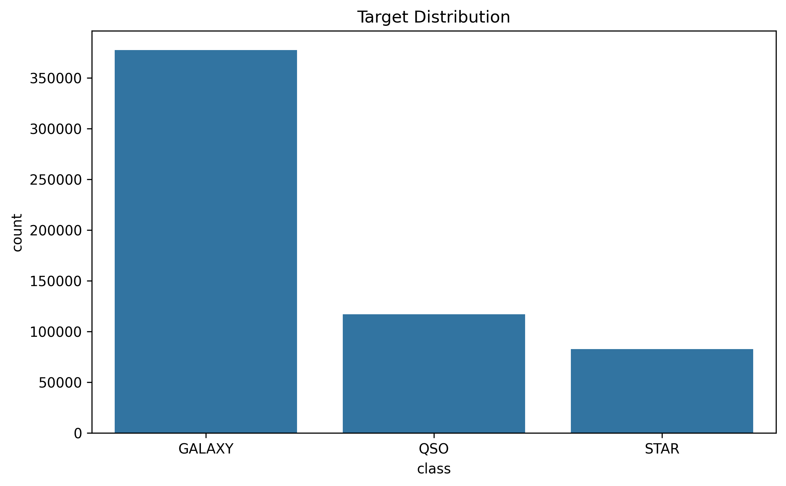

#### 2. Correlation Matrix
Visualizes the linear correlations between raw columns. The photometric filters (`u`, `g`, `r`, `i`, `z`) are highly correlated with each other.
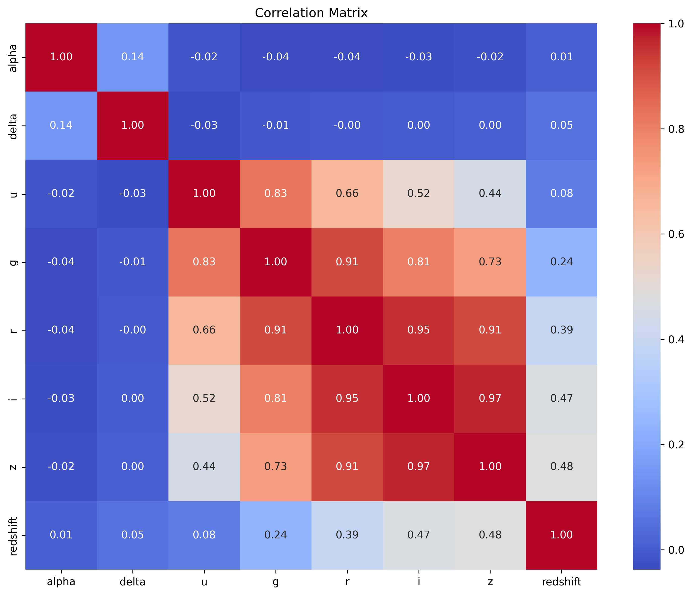

#### 3. Redshift by Class
Redshift is a critical feature: QSOs (quasars) have significantly higher redshift compared to stars and galaxies due to cosmological expansion.
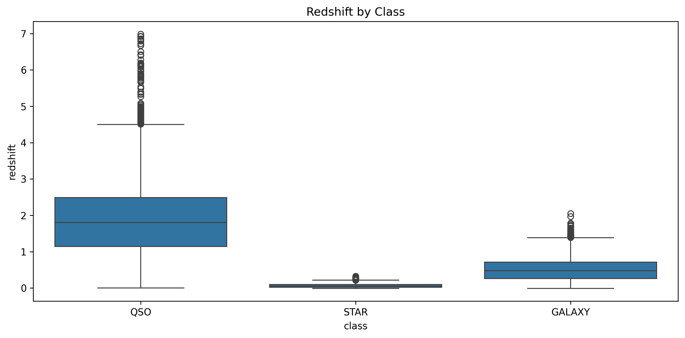

#### 4. Mutual Information Scores
Measures how much information features share with the target class. Redshift has the highest mutual information.
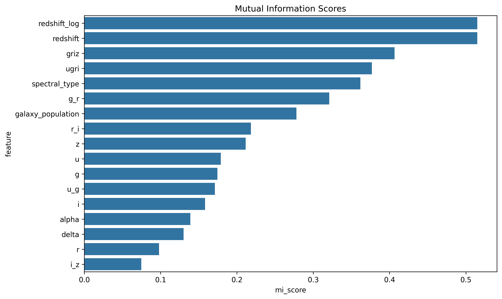

#### 5. Color Index Distributions
Spectral properties are represented by subtracting consecutive filter bands. Below are the distributions of key color indices:
| Ultraviolet - Green (`u - g`) | Green - Red (`g - r`) |
| :---: | :---: |
| 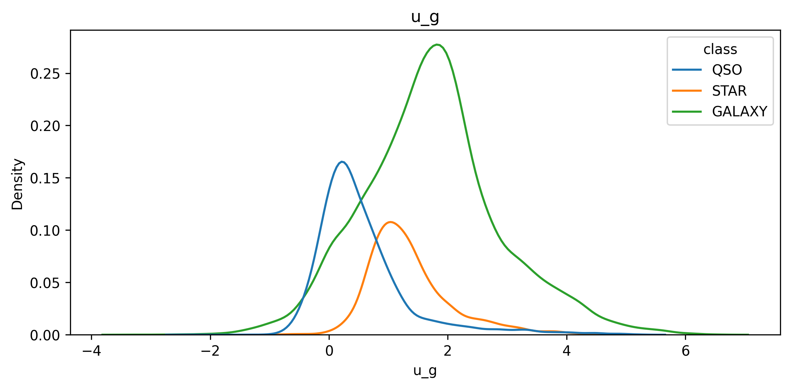 | 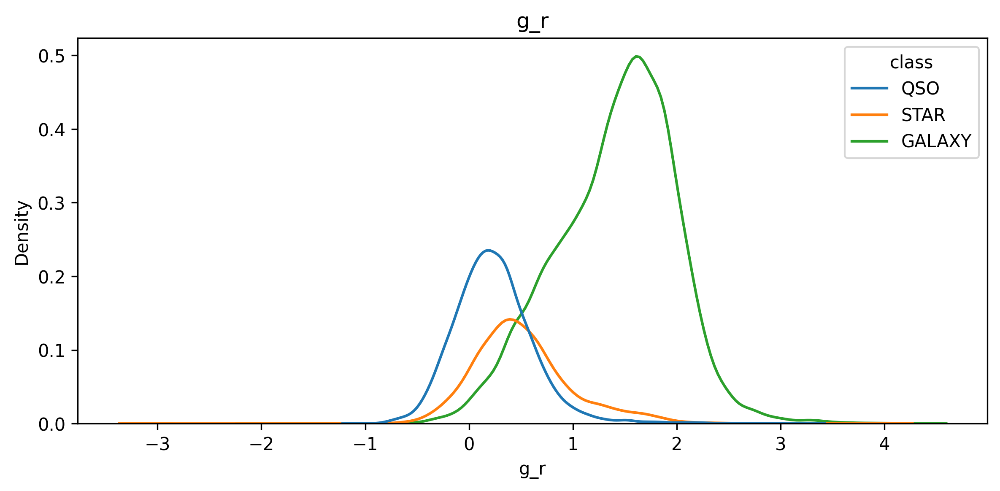 |

| Red - Near IR (`r - i`) | Near IR - IR (`i - z`) |
| :---: | :---: |
| 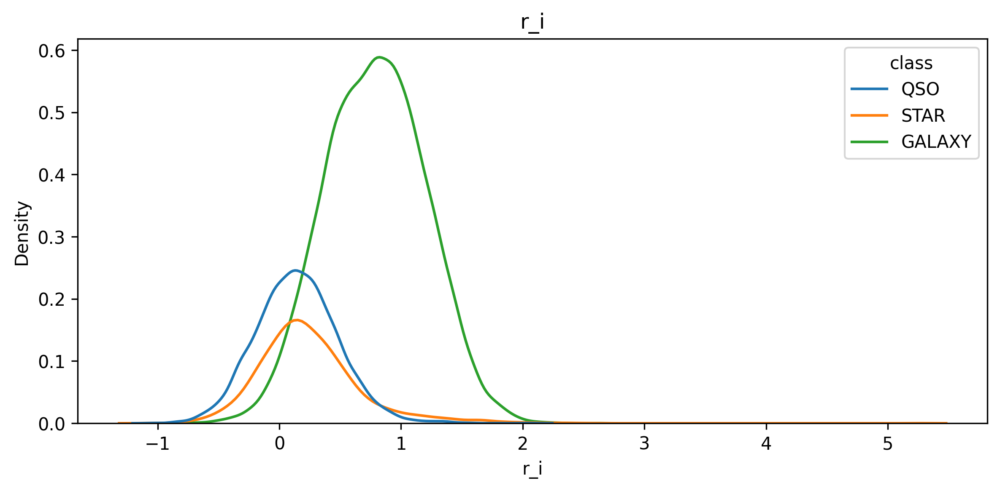 | 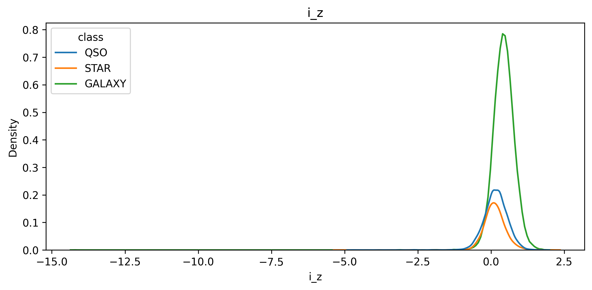 |

#### 6. Categorical Distributions
Below are the distributions of other key categorical attributes in the dataset:
| Spectral Type Distribution | Galaxy Population Distribution |
| :---: | :---: |
| 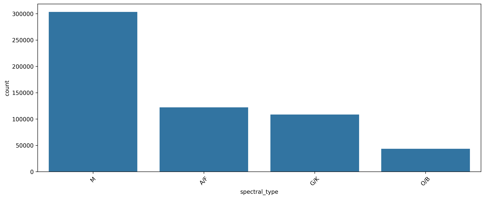 | 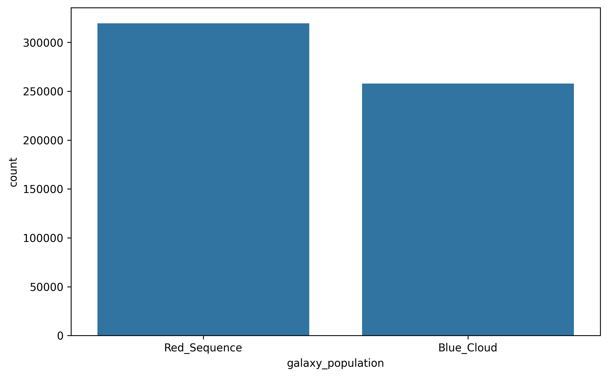 |

### Base Feature Engineering:
- Color indices representing astronomical spectral slopes:
  - `u_g` = $u - g$
  - `g_r` = $g - r$
  - `r_i` = $r - i$
  - `i_z` = $i - z$
- Extended wide color index differentials:
  - `ugri` = $u - i$
  - `griz` = $g - z$
- Log transformation of redshift to normalize the skew:
  - `redshift_log` = $\log(1 + \text{redshift})$

---

## Notebook 02: CatBoost GPU Baseline
**Purpose:** Build a robust, multi-class model baseline on GPU using 5-Fold Stratified Cross-Validation.
- **Model:** `CatBoostClassifier` trained on a Tesla T4 GPU.
- **Public LB Score:** `0.95304`
- **Output Files:**
  - `outputs/catboost/submission_catboost.csv`
  - `outputs/catboost/catboost_prob.csv`
  - `outputs/catboost/cv_scores.csv`
  - `outputs/catboost/feature_importance.csv`

---

## Notebook 03: XGBoost GPU + Advanced Astronomy Features
**Purpose:** Improve predictions by incorporating spatial transformations and non-linear properties.
- **Advanced Features Added:**
  - **Sky Coordinates:** Computed trigonometric spatial coordinates from spherical coordinates ($\alpha$ Right Ascension, $\delta$ Declination):
    $$x = \cos(\delta)\cos(\alpha)$$
    $$y = \cos(\delta)\sin(\alpha)$$
    $$z = \sin(\delta)$$
  - **Magnitude Ratios:** Ratios of filter intensities to model color proportions:
    - `u_div_g` = $\frac{u}{g}$
    - `g_div_r` = $\frac{g}{r}$
    - `r_div_i` = $\frac{r}{i}$
    - `i_div_z` = $\frac{i}{z}$
  - **Polynomial Redshift:** Non-linear scaling terms `redshift_sq` ($z^2$) and `redshift_cube` ($z^3$).
- **Model:** `XGBoostClassifier` on GPU.
- **Public LB Score:** `0.95798` (largest single jump in performance)

---

## Notebook 04: Probability Ensemble
**Purpose:** Blending prediction probabilities from CatBoost (Notebook 2) and XGBoost (Notebook 3) to reduce variance.
- **Ratios Tested:** `50/50`, `40/60`, `30/70`
- **Finding:** Ensembling did not outperform the best individual XGBoost model. This is likely due to the CatBoost baseline being significantly weaker than XGBoost, bringing the combined score down.

---

## Notebook 05: Optuna Hyperparameter Optimization
**Purpose:** Use automated tuning to locate the optimal parameters for the baseline XGBoost classifier.
- **Hyperparameters tuned:** `max_depth`, `learning_rate`, `subsample`, `colsample_bytree`, `min_child_weight`, `gamma`, `reg_alpha`, and `reg_lambda`.
- **Public LB Score:** `0.95627`
- **Finding:** Fine-tuning parameters on basic features was less effective than writing advanced feature interactions.

---

## Notebook 06: Feature Engineering V2 (Best Model)
**Purpose:** Add highly targeted interaction terms that map physical properties.
- **Trigonometric Sky Features:** `sin_alpha`, `cos_alpha`, `sin_delta`, `cos_delta`.
- **Redshift Interactions:** Multiplying redshift with wide-band indices:
  - `redshift_griz` = $\text{redshift} \times \text{griz}$
  - `redshift_ugri` = $\text{redshift} \times \text{ugri}$
  - `redshift_u_g` = $\text{redshift} \times (u - g)$
  - `redshift_g_r` = $\text{redshift} \times (g - r)$
  - `redshift_r_i` = $\text{redshift} \times (r - i)$
  - `redshift_sq_griz` = $\text{redshift}^2 \times \text{griz}$
- **Coordinates & Redshift Interactions:** Interaction terms between coordinates and redshift (`alpha_delta`, `alpha_redshift`, `delta_redshift`).
- **Redshift Quantiles:** Mapping objects into discrete bin intervals (`redshift_bin`).
- **Model:** GPU-accelerated XGBoost.
- **Public LB Score:** **`0.95904`**

---

## Notebook 07: Feature Engineering V3
**Purpose:** Test higher-order interaction features to push the accuracy boundaries.
- **Added Features:** `redshift_fourth`, `redshift_cube_griz`, `redshift_cube_ugri`, `redshift_log_griz`, `redshift_log_ugri`.
- **Public LB Score:** `0.95875`
- **Finding:** Over-engineering features resulted in overfitting to training cross-validation sets, leading to a minor drop in public leaderboard performance.

---

## Notebooks 08a & 08b: XGBoost Feature Engineering V2 Optimization
**Purpose:** Investigate model robustness and GPU non-determinism under `max_depth=6`, `learning_rate=0.05` and `n_estimators=2500` on V2 engineered features.
- **Validation (CV) Setup:** 5-Fold Stratified CV.
- **Mean CV Scores:** `0.958038` (Model A) vs `0.958041` (Model B).
- **Public LB Scores:** `0.95904` (Model A) vs `0.95879` (Model B).
- **Finding:** Running the exact same configuration on GPU twice resulted in slightly different test predictions and leaderboard scores due to parallel reduction ordering differences in XGBoost's `hist` tree method, although CV scores remained nearly identical.

---

## Notebook 08c: Deep Tree Exploration (Best Model)
**Purpose:** Test the boundaries of tree depth by increasing `max_depth` to 10 and reducing the learning rate to `0.02`.
- **Validation (CV) Setup:** 5-Fold Stratified CV.
- **Mean CV Score:** `0.957964`
- **Public LB Score:** **`0.95913` (Best Individual Model)**
- **Finding:** Deeper trees were able to capture complex high-order feature interactions generated in V2, successfully yielding the best public score without overfitting.

---

## Notebook 08d: Intermediate Tree Depth
**Purpose:** Explore tree depth of 8 and a learning rate of `0.03` with a different random state (`2025`).
- **Validation (CV) Setup:** 5-Fold Stratified CV.
- **Mean CV Score:** `0.957999`
- **Public LB Score:** `0.95904`
- **Finding:** Replicable performance with a slightly different hyperparameter trade-off, showing the robustness of the Feature Engineering V2 schema.

---

## Notebook 08f: High-Fold Cross-Validation Scaling
**Purpose:** Scale the cross-validation setup to a massive 30-Fold Stratified CV with a slower learning rate of `0.015`, deeper tree depth of 10, and `n_estimators=4000`.
- **Validation (CV) Setup:** 30-Fold Stratified CV.
- **Mean CV Score:** `0.957887`
- **Public LB Score:** `0.95864`
- **Finding:** Running 30 folds significantly reduced validation variance, resulting in a very robust mean CV score. However, the slightly lower public LB score suggested that the extremely large fold ensemble might slightly underfit the specific public test distribution compared to 5-fold models.

---

## Notebook xgb_pseudo2: Pseudo-Labeling Augmentation
**Purpose:** Leverage semi-supervised learning by training a strong initial classifier, predicting on the test set, and adding test predictions with confidence $> 0.9995$ back into the training set as pseudo-labels.
- **Validation Setup:** Retrained directly on the augmented dataset (original training data + pseudo-labeled test data).
- **Public LB Scores:**
  - **Pseudo Model 1:** `0.95876`
  - **Pseudo Model 2 (Run 1):** `0.95833`
  - **Pseudo Model 2 (Run 2):** `0.95889`
- **Process:**
  1. Train initial model on `train_fe.csv` with `max_depth=10`, `learning_rate=0.02`, `n_estimators=2500`.
  2. Predict probabilities on `test_fe.csv`.
  3. Filter test samples with maximum class probability $> 0.9995$ (resulting in 123,564 high-confidence pseudo-labeled rows).
  4. Concatenate original training data with the pseudo-labeled test data, increasing the training size to 700,911 samples.
  5. Retrain a final model with `n_estimators=3000`.
- **Finding:** Pseudo-labeling yielded highly stable models. The best run (v2) achieved a Public LB score of `0.95889`, validating the capability of semi-supervised learning to self-correct and refine decision boundaries on unlabeled test data.

---

# Feature Importance Insights

Analysis of feature importances across models reveals key astronomical relationships:

### XGBoost Feature Importance
XGBoost relies heavily on non-linear redshift terms and wide-band color indices.
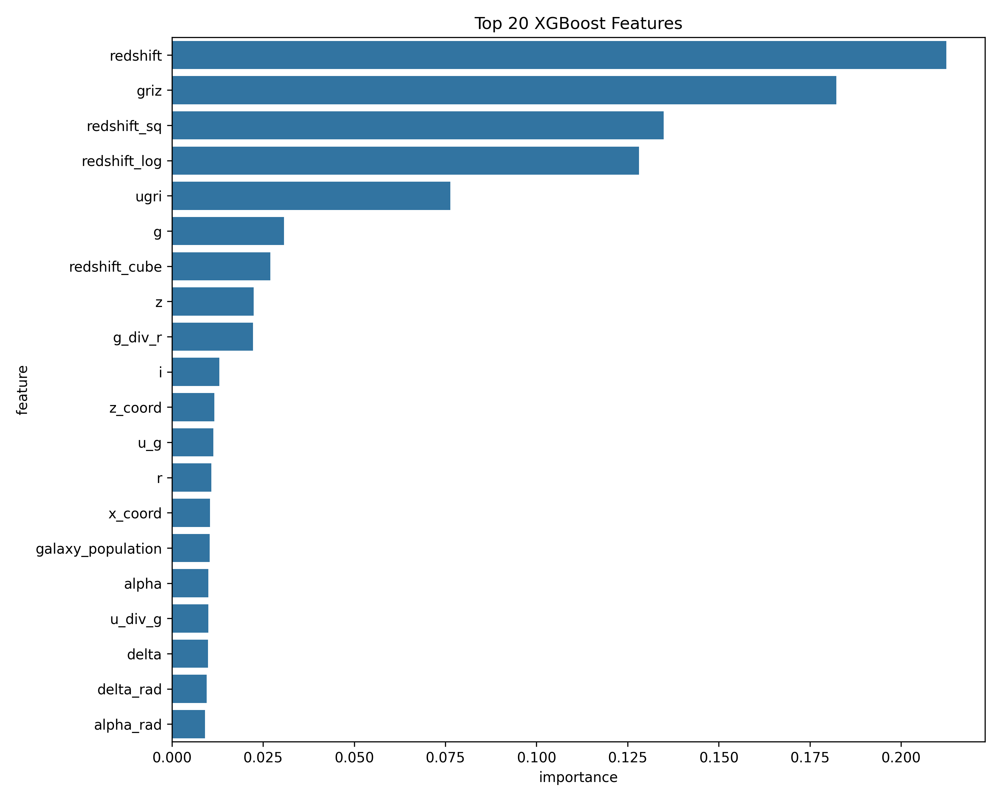

### CatBoost Feature Importance
CatBoost places high emphasis on the raw redshift feature alongside primary color indices.
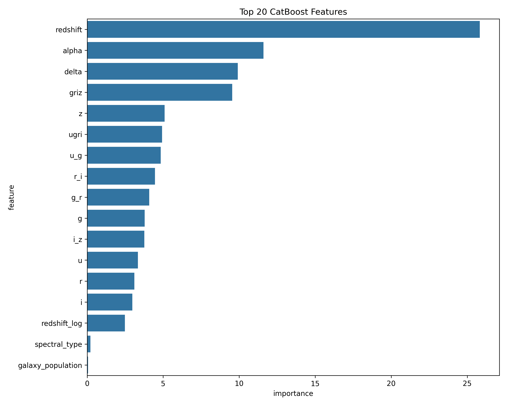

### Summary of Feature Value:
1. **Critical Features:** `redshift`, `redshift_cube`, `redshift_log`, `griz`, and `redshift_sq_griz`. The target classes (Galaxy, Star, Quasar) exhibit distinct redshift distributions, making redshift features the strongest discriminators.
2. **Useless Features:** `spectral_type` and `galaxy_population` contributed negligible predictive power and were omitted in later stages without performance loss.

---

# Lessons Learned

1. **Feature Engineering > Tuning:** Creating custom astronomical features (like redshift interactions and sky coordinate transformations) provided much larger score boosts than automated hyperparameter tuning.
2. **Beware of Over-Engineering:** Moving from Feature Engineering V2 to V3 (higher-order polynomial interactions) improved local cross-validation score but led to overfitting on the public leaderboard.
3. **Model Diversity is Key for Ensembling:** Simple averaging of a strong XGBoost model and a weaker CatBoost model resulted in performance degradation. Blending is only effective when models are both diverse and similarly strong.
4. **Physical Domain Knowledge Matters:** Framing variables as physical coordinates and astronomical colors was crucial to unlocking the data's underlying patterns.

---

# Environment & Dependencies

- **Platform:** Google Colab
- **GPU Accelerator:** Tesla T4 GPU
- **Key Libraries:**
  - `pandas`
  - `numpy`
  - `scikit-learn`
  - `xgboost`
  - `catboost`
  - `optuna`
  - `matplotlib`
  - `seaborn`

To install dependencies locally:
```bash
pip install -r requirements.txt
```

---

# Author
**Krish D Shah**
- **Portfolio:** [thekrishdshah.vercel.app](https://thekrishdshah.vercel.app/)
- **GitHub:** [@Krishdshah](https://github.com/Krishdshah)
- **LinkedIn:** [in/thekrishdshah](https://linkedin.com/in/thekrishdshah)

---

# License
This project is licensed under the terms of the license files included in this repository.
